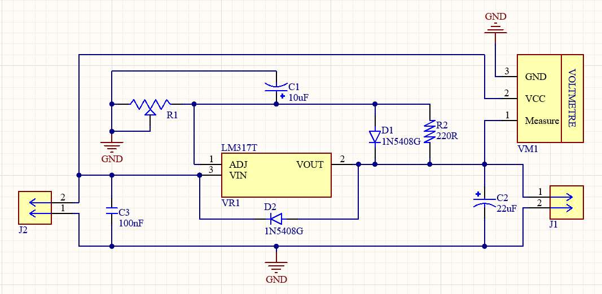
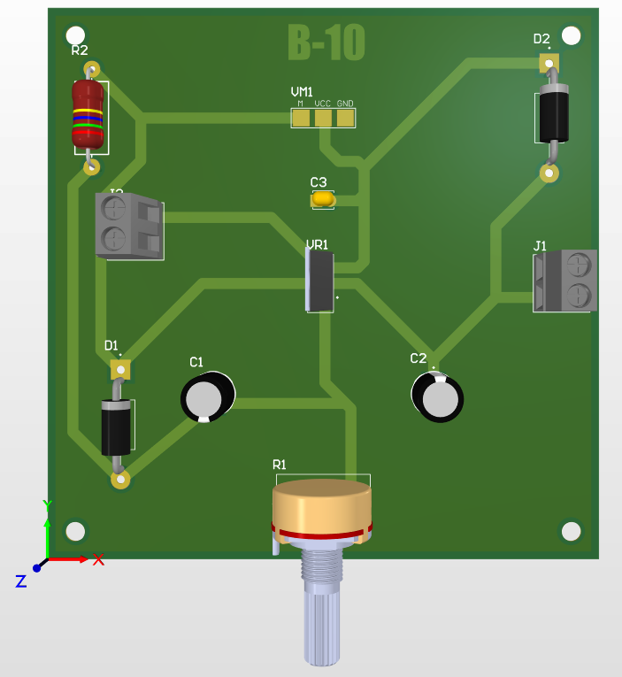
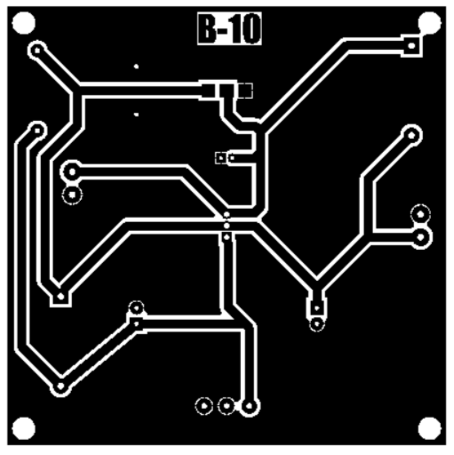
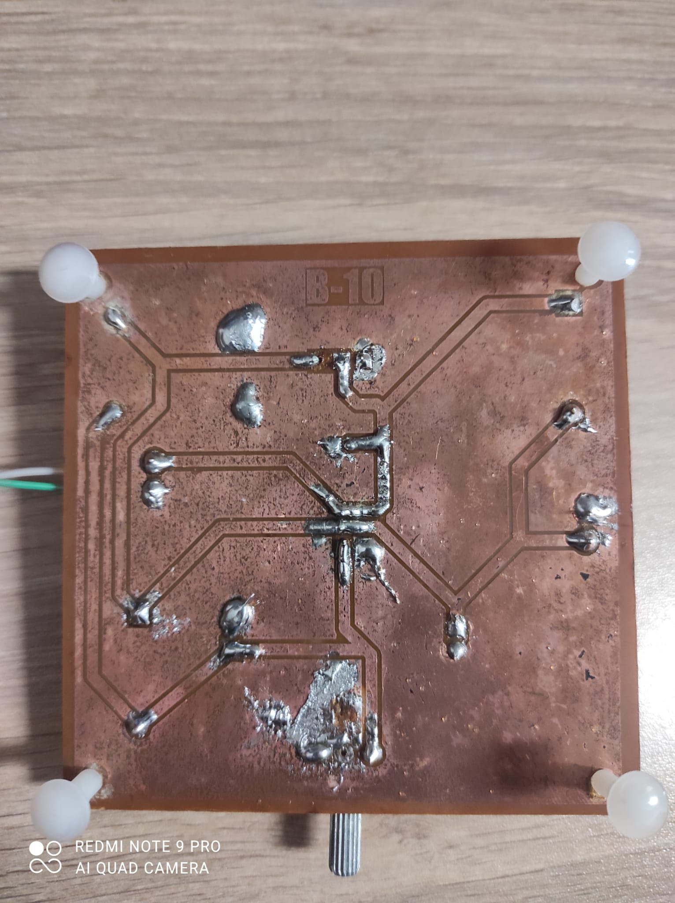
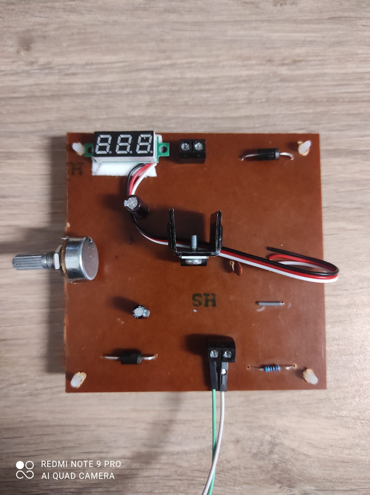
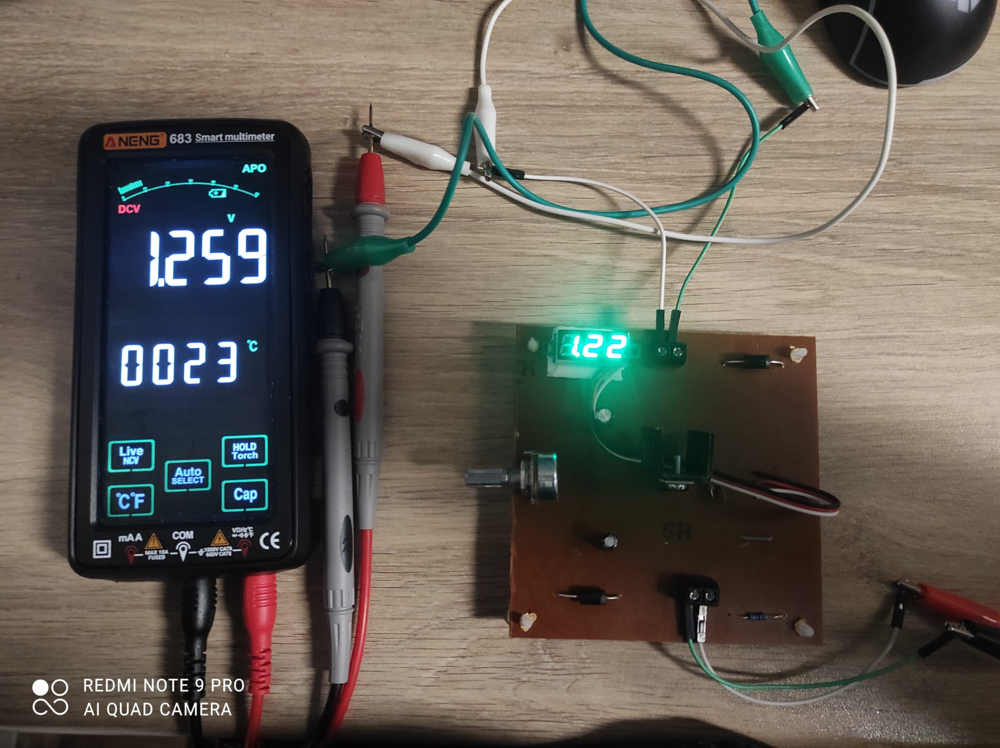
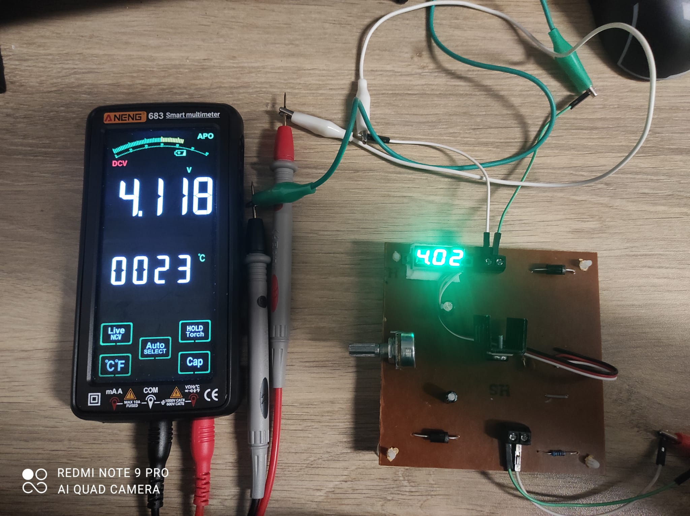
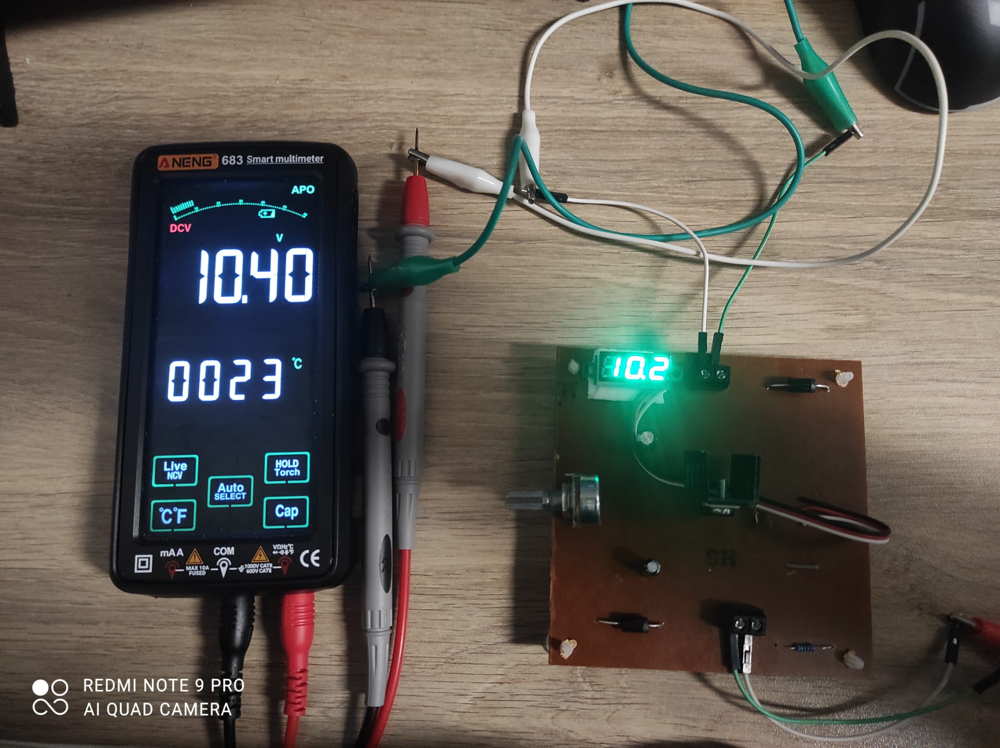

# LM317T Adjustable Voltage Regulator PCB

A custom-designed, single-layer adjustable DC voltage regulator PCB capable of providing a stable output up to 35V. This project features robust power routing, integrated thermal management, and was entirely manufactured from scratch using DIY chemical etching techniques. 

## 📸 Project Visuals

| Schematic | 3D Render |
|---|---|
|  |  |

| PCB Print Layout | Soldered Bottom Layer |
|---|---|
|  |  |

### Physical Implementation

## 🚀 Key Features & Hardware Architecture
* **Strictly Through-Hole Design:** Fully implemented using only through-hole technology (THT) components to ensure accessible DIY manufacturing, drilling, and soldering.
* **Onboard Real-Time Monitoring:** Features an integrated mini digital voltmeter connected directly parallel to the output terminals for instant voltage feedback.
* **Robust Power Routing:** Power traces are specifically sized at **2mm width** to safely handle higher currents (1A+), with all routing avoiding sharp 90-degree angles to ensure manufacturing and electrical reliability.
* **Noise Minimization:** A comprehensive copper pour (Ground Plane) spans the entire bottom layer to minimize electrical noise and provide a stable ground reference.
* **DIY Manufacturing Process:** Manufactured using the toner-transfer method (glossy paper and heat), followed by chemical etching utilizing Hydrochloric Acid (HCl) and Hydrogen Peroxide (H2O2).

## 🛡️ Hardware-Enforced Protection Mechanisms
To ensure the longevity and safety of the power supply, specific hardware protections are integrated into the design:
1. **Reverse Discharge Protection:** Two 1N5408G diodes are strategically placed across the LM317T regulator. These prevent capacitors from discharging back through the regulator when the system is powered off or shorted, which could otherwise destroy the IC.
2. **Thermal Management:** A dedicated footprint and physical heat-sink are incorporated for the LM317T. This dissipates excess heat, preventing the IC from hitting its internal thermal shutdown threshold during high power dissipation scenarios.

## 📋 System Testing Sequence (12V Input Source)
The initial functional verification of the manufactured PCB was conducted using a 12V DC input. The potentiometer successfully adjusted the output across its full range.

| Potentiometer State | Input Voltage | Multimeter Measurement | Onboard Display Reading | Description |
|---|---|---|---|---|
| **Minimum** | 12V DC | 1.259 V | 1.22 V | The baseline reference voltage of the LM317T. |
| **Intermediate** | 12V DC | 4.118 V | 4.02 V | Stable mid-range adjustment demonstrating linear control. |
| **Maximum** | 12V DC | 10.40 V | 10.2 V | Peak output constrained by the 12V input source and internal dropout. |

### 🔍 Visual Test Results
| Minimum Output Test | Intermediate Output Test | Maximum Output Test |
|---|---|---|
|  |  |  |

## 📦 Bill of Materials (BOM)
* **ICs & Displays:** 1x LM317T Voltage Regulator, 1x Mini Digital Voltmeter (2.5V - 30V)
* **Semiconductors:** 2x 1N5408G High-Current Diodes
* **Passives:** 1x 10µF Electrolytic Capacitor, 1x 22µF Electrolytic Capacitor, 1x 100nF Ceramic Capacitor, 1x 220Ω Resistor, 1x Potentiometer
* **Connectors:** 2x 2-Pin Screw Terminal Blocks (Input & Output)
* **Hardware:** 1x Heat-sink (Regulator), 4x Plastic Standoffs (Corner mounting points)

---
*Designed and manufactured by İsmet Akalın & Ferhan Özgür Uluç.*
